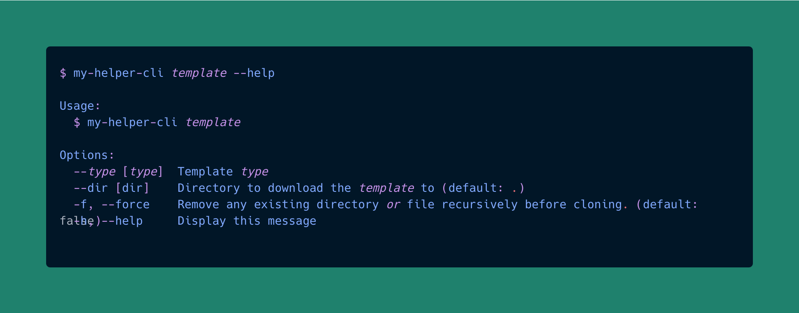

<h1>quick starter</h1>
<pre align="center"><b>quick-starter</b></pre>

<p align='center'>
    
</p>

## Features
- Download templates to your destination folder
- Manage your templates via configuration files
- More: https://www.npmjs.com/package/giget#Features

## Usage
```shell
quick-starter [name] [dir]
```
#### The template is sourced from github/gitlab/bitbucket/sourcehut/https URL
```shell
quick-starter gh:antfu-collective/vitesse ./
```
> [More usage examples can be found in the link](https://www.npmjs.com/package/giget#Examples)

#### The template is sourced local path
```shell
quick-starter ./localDir/localName ./
```

## Alternatives
- [giget](https://github.com/unjs/giget)
- [cac](https://github.com/cacjs/cac)

## License

MIT License © 2020 [Ardanas](https://github.com/Ardanas)
