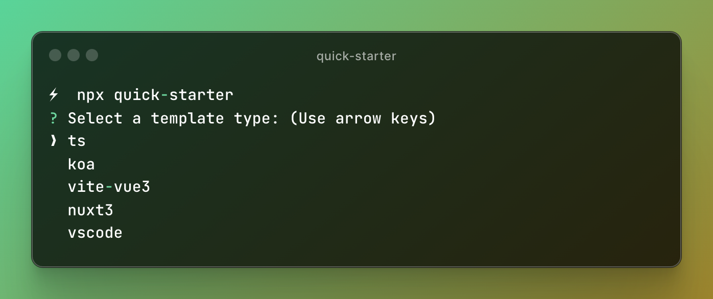
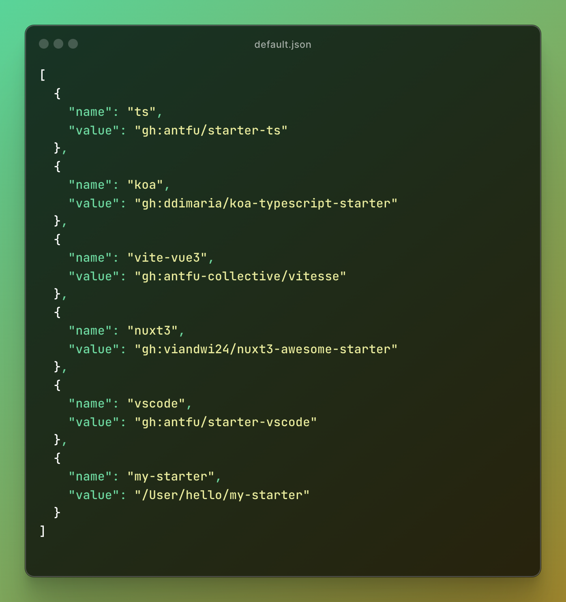

<h1>⚡️ quick starter</h1>
<pre align="center">npx <b>quick-starter</b></pre>

<p align='center'>

</p>

## Features
- ✨ Manage your templates via configuration files
- ✨ Support cloning templates from locally.
- ✨ Support pulling templates from popular git providers.
- ✨ [More](https://www.npmjs.com/package/giget#Features)

## Usage(CLI)
```shell
quick-starter [template] [dir] [...options]
```
<p align='center'>

</p>

### Arguments
- **template**:
    - Template name or a URI describing provider, repository, sub dir, and branch/ref. (See [Examples](https://www.npmjs.com/package/giget#Examples))
    - from your config
- **dir**: A relative or absolute path where to extract the template. By default, it is the current directory.

### Options
`-d, --dir`: A relative or absolute path where to extract the template, with the highest priority.

`-c, --config`: Temporarily configure your template file, but do not modify the default configuration file.

`-f, --force`: Clone and overwrite an existing directory.

[More options](https://www.npmjs.com/package/giget#Options)

### Examples

#### 1. Clone the template from your template configuration file

```shell
⚡  npx quick-starter
```
<p align='center'>

</p>

> If you haven't set up your template configuration file yet, we provide a default template configuration

<p align='center'>

</p>

#### 2. Clone the template locally to the specified location

```shell
npx quick-starter ./dir/filename ./
```

#### 3. Clone the template remotely to the specified location
```shell
npx quick-starter gh:antfu/starter-ts ./
```

#### 4. [More Examples](https://www.npmjs.com/package/giget#Examples)

## Manage your templates
#### 1. Overwrite default template configuration
```shell
npx quick-starter config set ../filePath
```

#### 2. Edit template configuration
```shell
npx quick-starter config edit
```
> After executing the command, it will enter vi editing mode

#### 3. View the current template configuration
```shell
npx quick-starter config list
```

## Alternatives
- [giget](https://github.com/unjs/giget)
- [cac](https://github.com/cacjs/cac)

## License

MIT License © 2024 [Ardanas](https://github.com/Ardanas)
